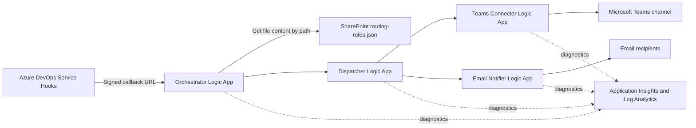

# Architecture

## Runtime Flow

## Components

| Component | Responsibility |
|---|---|
| Azure DevOps Service Hooks | Send `workitem.created` and `workitem.updated` events |
| Orchestrator | Normalize work-item fields, load rules from SharePoint, evaluate matches, and call the Dispatcher |
| SharePoint API connection | Authenticate the Orchestrator's read access to the routing document |
| Dispatcher | Fan matching rules out to Teams and email |
| Teams connector | Post to the Team and channel identified by `teamsTeamId` and `teamsChannelId` |
| Email notifier | Send primary and escalation messages through SendGrid |
| Application Insights | Collect Logic App runtime diagnostics |

## Authentication

The Azure DevOps endpoint is the signed callback URL generated for `Receive_WorkItem_Webhook`. Its SAS query parameters authenticate invocation, so no custom webhook header is required.

SharePoint and Teams use Azure managed API connections authorized by Microsoft 365 accounts. The SharePoint account requires read access to the routing document. The Teams account requires membership and posting permission in each destination channel.

## Routing Configuration

The live configuration is a SharePoint document named `routing-rules.json`. The Orchestrator reads it for each event, so changing rules does not require an Azure deployment.

Each route contains matching conditions and destinations. Rules may overlap; every matching enabled rule is dispatched. Lower numeric priorities are evaluated first.

## Deployment

[bicep/main.bicep](../bicep/main.bicep) deploys:

- Application Insights and Log Analytics
- Orchestrator Logic App
- Dispatcher Logic App
- Teams connector Logic App
- Email notifier Logic App
- SharePoint API connection
- Teams API connection

The deployment does not provision an Azure Function, routing storage account, Key Vault, Power Automate workflow, or Teams incoming webhook.
