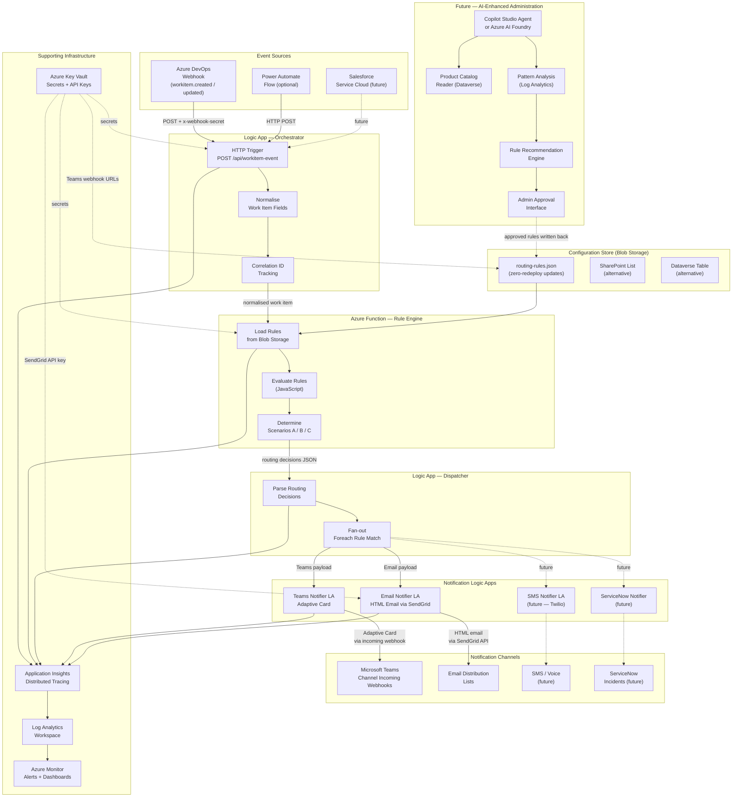
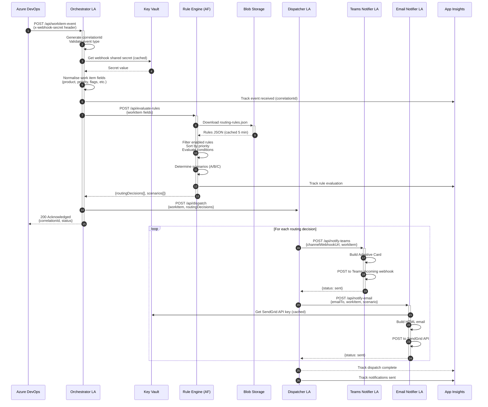
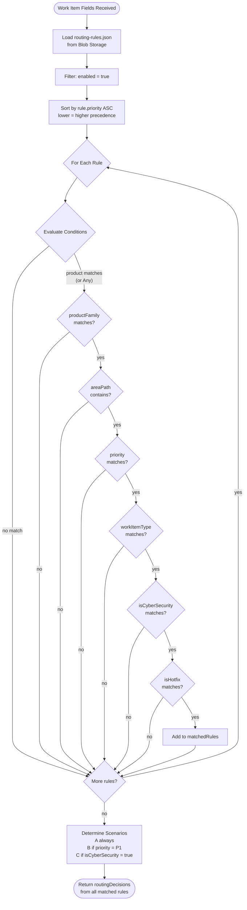
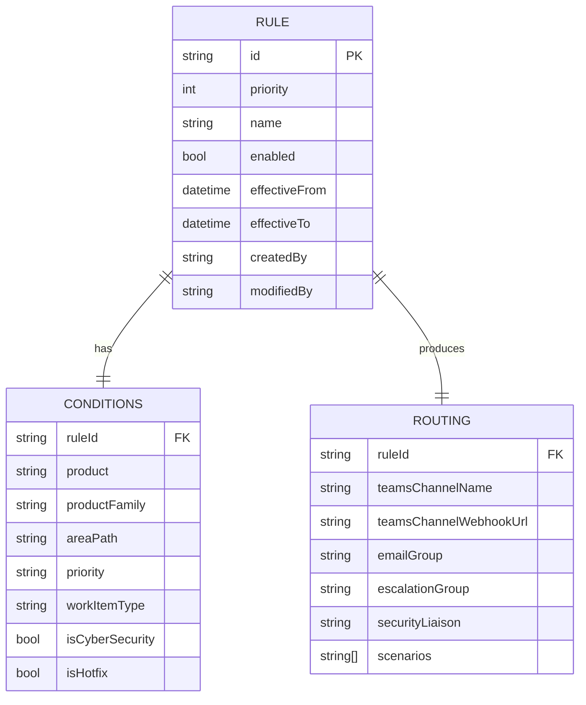
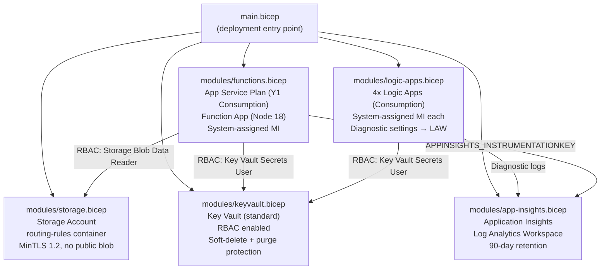

# Architecture — Azure Logic Apps Enterprise Notification Routing

## 1. High-Level System Architecture



---

## 2. Event Processing Sequence



---

## 3. Rule Evaluation Logic



---

## 4. Routing Rule Data Model



---

## 5. Bicep Deployment Topology



---

## 6. Error Handling Strategy

```mermaid
flowchart TD
    EVENT[Incoming Webhook Event] --> SCOPE_MAIN

    subgraph SCOPE_MAIN["Scope: Main Processing (Orchestrator)"]
        VALIDATE[Validate event type] --> EXTRACT_F
        EXTRACT_F[Extract fields] --> CALL_RE
        CALL_RE[Call Rule Engine\nRetry: exponential x3\nMax interval: 60s] --> CALL_DISP
        CALL_DISP[Call Dispatcher\nRetry: exponential x3\nMax interval: 120s]
    end

    SCOPE_MAIN -->|"Failed / TimedOut"| SCOPE_ERR

    subgraph SCOPE_ERR["Scope: Error Handler"]
        LOG_ERR[Compose error details\ncorrelationId + action results] --> ALERT_APPI
        ALERT_APPI[Track custom event\nin App Insights] --> NOTIFY_OPS
        NOTIFY_OPS[Notify Ops channel\n(critical failures only)]
    end

    SCOPE_MAIN -->|"Succeeded / Skipped"| ACK_200
    SCOPE_ERR -->|"Succeeded / Skipped"| ACK_200

    ACK_200["Response 200 OK\n(always — prevent ADO retry storms)"]
```

**Key decisions:**
- Always return `HTTP 200` to the Azure DevOps webhook to prevent ADO from retrying and flooding the pipeline.
- Use `Scope` actions to isolate failures without breaking the acknowledgement response.
- Use exponential retry on all outbound HTTP calls (3 attempts, 5 s → 60 s intervals).
- Dead-letter failed events to a storage queue for manual replay.

---

## 7. Future AI-Enhanced Administration Model

```mermaid
flowchart TB
    subgraph AI_AGENT["AI Agent (Copilot Studio / AI Foundry)"]
        AGENT_TRIGGER["Trigger: Scheduled Daily\nor Admin Chat Message"]
        READ_CATALOG["Read Product Catalog\n(Dataverse / SharePoint)"]
        READ_LOGS["Analyse Routing Patterns\n(Log Analytics KQL)"]
        READ_RULES["Read Current Rules\n(Blob Storage)"]
        GENERATE["Generate Rule Recommendations\n(GPT-4o with function calling)"]
        DIFF["Compute Rule Diff\n(new, modified, obsolete)"]
        PRESENT["Present to Admin\n(Adaptive Card in Teams)"]
        APPROVE{Admin\nApproves?}
        WRITE_BACK["Write Approved Rules\nto Blob Storage\n(via Logic App)"]
        AUDIT["Write Audit Entry\n(Log Analytics)"]
    end

    AGENT_TRIGGER --> READ_CATALOG
    READ_CATALOG --> READ_LOGS
    READ_LOGS --> READ_RULES
    READ_RULES --> GENERATE
    GENERATE --> DIFF
    DIFF --> PRESENT
    PRESENT --> APPROVE
    APPROVE -->|"Yes"| WRITE_BACK
    APPROVE -->|"No"| AUDIT
    WRITE_BACK --> AUDIT
```



### AI Agent Tools (Function Calling)

| Tool Name | Description |
|-----------|-------------|
| `get_product_catalog` | Retrieves all products and families from Dataverse |
| `get_routing_rules` | Reads current routing-rules.json from Blob |
| `get_notification_statistics` | KQL query over Log Analytics for routing hit rates |
| `get_unmatched_events` | Events that matched only the catch-all rule |
| `propose_rule_changes` | Returns structured JSON diff of proposed changes |
| `apply_rule_changes` | Writes approved rules back after admin confirmation |

---

## 8. Monitoring Dashboard KQL Queries

### Events Processed Per Hour
```kusto
customEvents
| where name == "WorkItemEventReceived"
| summarize count() by bin(timestamp, 1h)
| render timechart
```

### Rules Matched Distribution
```kusto
customEvents
| where name == "RuleEvaluationComplete"
| extend matchCount = toint(customDimensions["matchedRuleCount"])
| summarize avg(matchCount), max(matchCount), count() by bin(timestamp, 1h)
```

### Notification Delivery Failures
```kusto
customEvents
| where name == "NotificationFailed"
| project timestamp, correlationId = tostring(customDimensions["correlationId"]),
    channel = tostring(customDimensions["channel"]),
    reason = tostring(customDimensions["reason"])
| order by timestamp desc
```

### Processing Latency (End-to-End)
```kusto
customEvents
| where name in ("WorkItemEventReceived", "DispatchComplete")
| extend correlationId = tostring(customDimensions["correlationId"])
| summarize startTime = min(timestamp), endTime = max(timestamp) by correlationId
| extend latencyMs = datetime_diff('millisecond', endTime, startTime)
| summarize avg(latencyMs), percentile(latencyMs, 95), percentile(latencyMs, 99)
```
